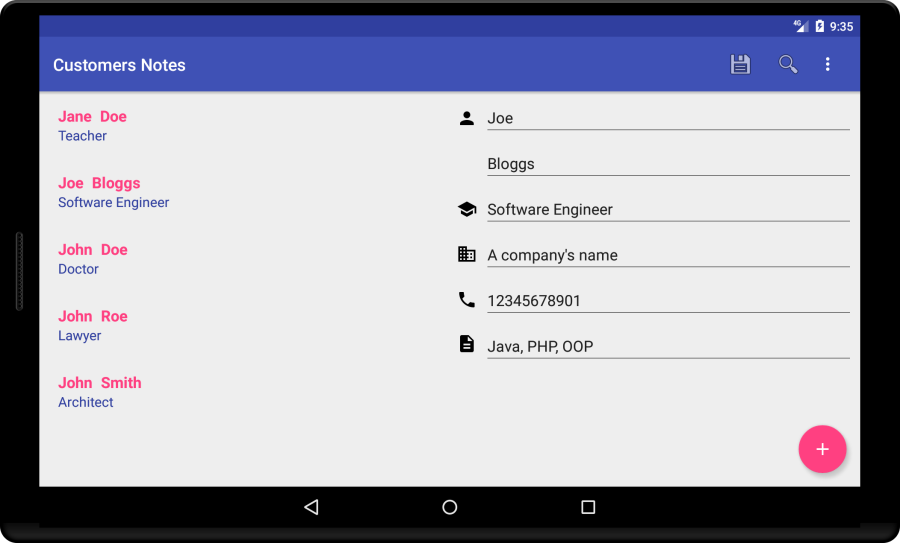

# Customers Notes
Customers Notes is an android application to help users keep notes about their customers.
This application created for MVP Pattern and Unit Testing demonstration purposes.

## Features
* Customers Notes
* Database external storage backup and restore

## Application Design
Application implements MVP (Model-View-Presenter) Pattern.
Customers are stored in SQLite database using Content Providers.

## Credits
* Icons from [Material.io](https://material.io) and [icons8](https://icons8.com)
* [Mockito](http://site.mockito.org/) Mocking Framework
* [Espresso Testing Library](https://google.github.io/android-testing-support-library/)
* [Robolectric unit test framework](http://robolectric.org/)

## License
This project is released under Apache v2.0 license [http://www.apache.org/licenses/LICENSE-2.0.html](http://www.apache.org/licenses/LICENSE-2.0.html)